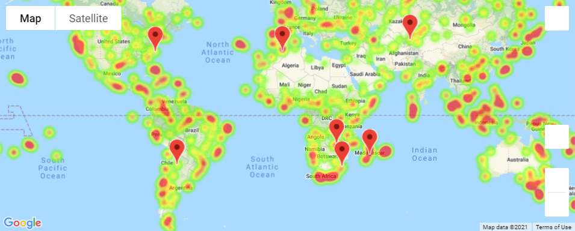

# python-api-challenge

Weather Py -> This is a project to provide insights to weather details by city.
Vacation Py -> Provides recommendations to the top hotels based on city search criteria.
### Dependencies / Requirements:

- matplotlib pandas, numpy -> Standard Tools
- requests -> fecthing the data
- time -> needed for waits
- scipy.stats ->  Math
- concurrent.futures ->  multi-threading the requests

## Setup

Make sure you have the following:

- Google API key with access to google maps and google places.
    - Add this to VacationPy/api_keys.py
- Open Weather API access https://openweathermap.org/api
    - Add this to WeatherPy/api_keys.py